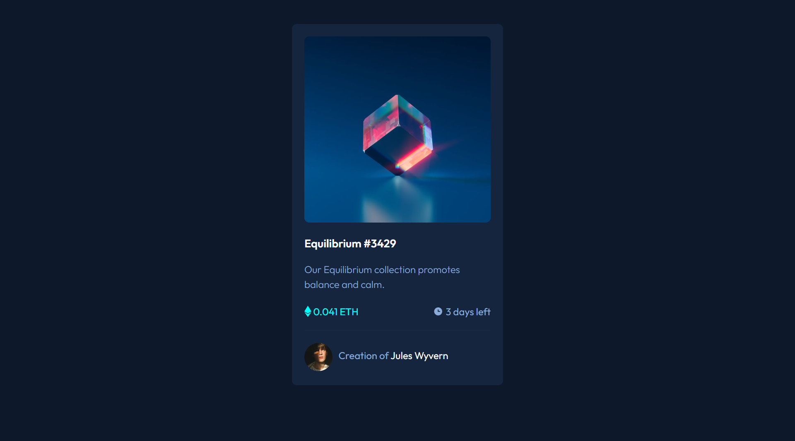

# Frontend Mentor - NFT preview card component solution

This is a solution to the [NFT preview card component challenge on Frontend Mentor](https://www.frontendmentor.io/challenges/nft-preview-card-component-SbdUL_w0U). Frontend Mentor challenges help you improve your coding skills by building realistic projects. 

## Table of contents

- [Overview](#overview)
  - [The challenge](#the-challenge)
  - [Screenshot](#screenshot)
  - [Links](#links)
- [My process](#my-process)
  - [Built with](#built-with)
  - [What I learned](#what-i-learned)
  - [Continued development](#continued-development)
  - [Useful resources](#useful-resources)
- [Author](#author)


**Note: Delete this note and update the table of contents based on what sections you keep.**

## Overview

### The challenge

Users should be able to:

- View the optimal layout depending on their device's screen size
- See hover states for interactive elements

### Screenshot




### Links

- Solution URL: [Check solution here](https://github.com/rereloluwavictor2001/NFT-preview-card-)
- Live Site URL: [The Live site](https://rereloluwavictor2001.github.io/NFT-preview-card-/)

## My process

### Built with

- Semantic HTML5 markup
- CSS custom properties
- Flexbox
- CSS Grid
- [Styled Components](https://styled-components.com/) - For styles


### What I learned

Below are the new things I learned during the course of this challenge:

```html
        <svg id="icon" width="48" height="48" xmlns="http://www.w3.org/2000/svg"><g fill="none" fill-rule="evenodd"><path d="M0 0h48v48H0z"/><path d="M24 9C14 9 5.46 15.22 2 24c3.46 8.78 12 15 22 15 10.01 0 18.54-6.22 22-15-3.46-8.78-11.99-15-22-15Zm0 25c-5.52 0-10-4.48-10-10s4.48-10 10-10 10 4.48 10 10-4.48 10-10 10Zm0-16c-3.31 0-6 2.69-6 6s2.69 6 6 6 6-2.69 6-6-2.69-6-6-6Z" fill="#FFF" fill-rule="nonzero"/></g></svg>

```
```css
#icon {
    transform: translate(0, 120px);
}
.icon-div {
  opacity: 0;
}
.icon-div:hover{
    opacity: 0.5;
}
```

### Continued development

I still need to get more comfortable with bootstrap and css3 as I progress in this journey. 


### Useful resources

- [The complete web development bootcamp 2022](https://www.udemy.com/course/the-complete-web-development-bootcamp/learn/lecture/12374120?start=0#search) - This helped me with html 5, css3 ad bootstrap 4. I really liked this pattern and will use it going forward.
- [Bootstrap 4](https://www.getbootstrap.com) - This is an amazing article which helped me finally understand bootstrap 4 and how to use it properly. I'd recommend it to anyone still learning this concept.


## Author

- Frontend Mentor - [my username](https://www.frontendmentor.io/profile/rereloluwavictor2001)
- Twitter - [check my profile here](https://www.twitter.com/rereloluwaalimi)


